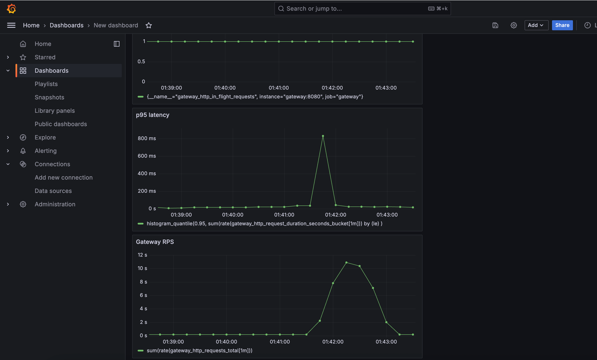

# Go API Gateway 🚀

High-performance, lightweight API Gateway written in Go, featuring routing, rate limiting, observability, and resilience mechanisms.

[](https://golang.org/)
[](LICENSE)

---

## ✨ Features

- **Performance**: Built with `chi` for fast, lightweight HTTP routing.
- **Rate Limiting**: Per-IP token-bucket rate limiting to prevent upstream overload.
- **Resilience**: Integrated **Retry** and **Circuit Breaker** patterns for proxying.
- **Observability**: Native Prometheus metrics and structured logging.
- **Security**: Request ID propagation and panic recovery middleware.
- **Documentation**: Built-in OpenAPI specification and Swagger UI.
- **Modern**: Fully containerized with Docker and Docker Compose.

---

## 🛠 Tech Stack

- **Language**: Go 1.25
- **Router**: [go-chi/chi](https://github.com/go-chi/chi)
- **Metrics**: [Prometheus](https://prometheus.io/)
- **Monitoring**: [Grafana](https://grafana.com/)
- **Documentation**: [OpenAPI (Swagger)](https://swagger.io/specification/)
- **Containerization**: Docker & Docker Compose

---

## 🚀 Getting Started

### Prerequisites

- Go 1.25+ (for local development)
- Docker & Docker Compose (for running the full stack)

### Quick Start (Docker)

To launch the Gateway along with the Auth service, Prometheus, Grafana, and Swagger UI:

```bash
docker compose up --build
```

### Local Development

1. Install dependencies:
   ```bash
   go mod download
   ```

2. Run the server:
   ```bash
   go run ./cmd/server
   ```
   *Note: Ensure `AUTH_SERVICE_URL` is configured if testing proxying.*

---

## ⚙️ Configuration

The Gateway is configured using environment variables.

| Variable | Description | Default |
|----------|-------------|---------|
| `APP_PORT` | Port for the gateway server | `8080` |
| `APP_ENV` | Environment (`local`, `docker`) | `local` |
| `LOG_LEVEL` | Logging level (`debug`, `info`, `warn`, `error`) | `info` |
| `AUTH_SERVICE_URL` | Upstream Auth service URL | `http://localhost:8081` |
| `UPSTREAM_TIMEOUT_SECONDS` | Proxy request timeout | `5` |
| `RATE_LIMIT_RPS` | Allowed requests per second per IP | `10` |
| `RATE_LIMIT_BURST` | Burst capacity per IP | `20` |

---

## 🛣 API Endpoints

### Internal
- `GET /health`: Health check endpoint.
- `GET /metrics`: Prometheus metrics.
- `GET /api/v1/ping`: Simple connectivity test.
- `GET /docs/*`: Serves `openapi.yaml`.

### Proxying (to Auth Service)
- `ANY /api/v1/auth/*`: Routed to Auth Service.
- `ANY /api/v1/users/*`: Routed to Auth Service.

---

## 🛡 Resilience & Rate Limiting

- **Rate Limiting**: Rejects excessive traffic with `429 Too Many Requests` and includes `Retry-After` header.
- **Retries**: Automatically retries failed requests to upstream services.
- **Circuit Breaker**: Monitors upstream health and "trips" if failures exceed thresholds, preventing cascading failures.

---


## 📊 Monitoring & Observability

The project includes a pre-configured Grafana dashboard to monitor Gateway performance:



The dashboard tracks:
- Request Rate (RPS)
- Error Rates (4xx/5xx)
- Request Latency (P95, P99)
- Circuit Breaker Status
- Rate Limiting Drops

---

### Infrastructure Links

| Service | URL | Credentials |
|---------|-----|-------------|
| **Gateway** | [http://localhost:8080](http://localhost:8080) | - |
| **Swagger UI** | [http://localhost:8082](http://localhost:8082) | - |
| **Prometheus** | [http://localhost:9090](http://localhost:9090) | - |
| **Grafana** | [http://localhost:3000](http://localhost:3000) | `admin` / `admin` |

---
## 📜 License

This project is licensed under the MIT License - see the [LICENSE](LICENSE) file for details.
